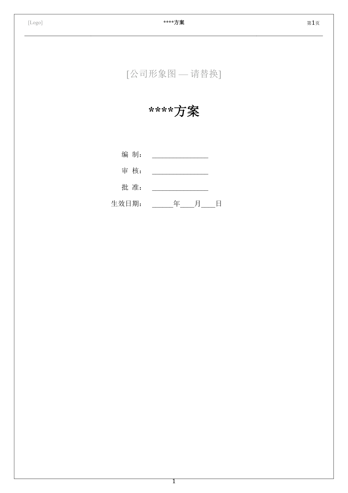
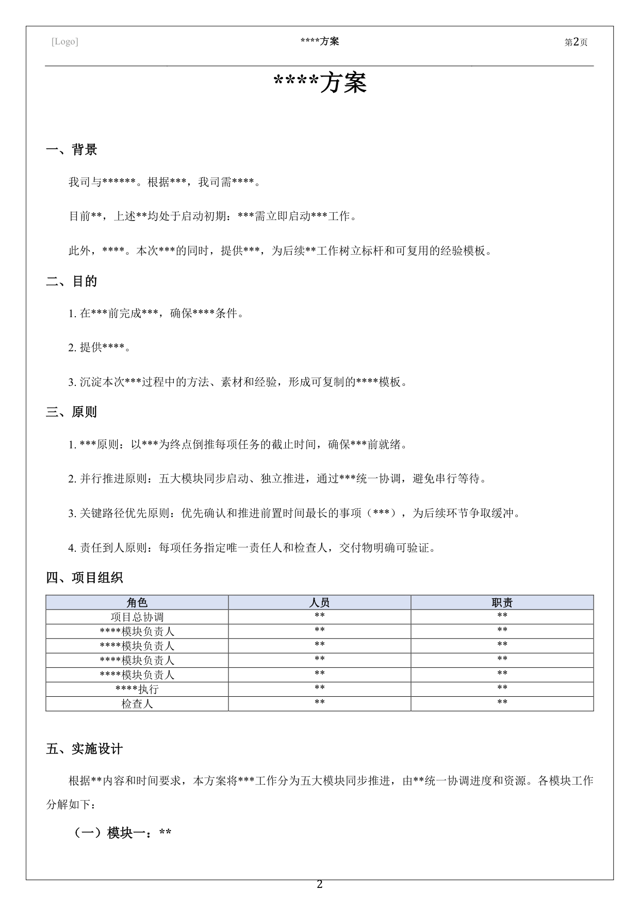
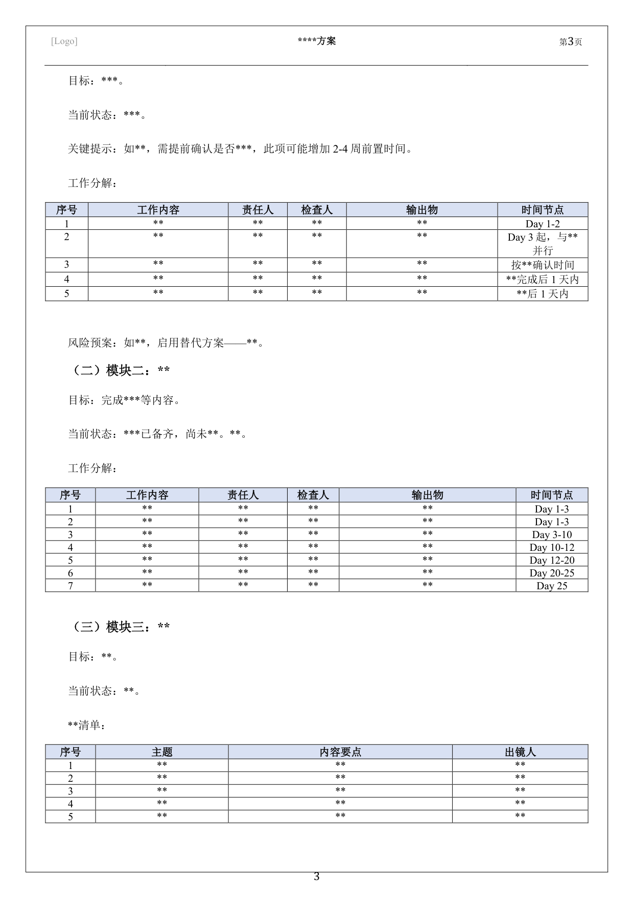
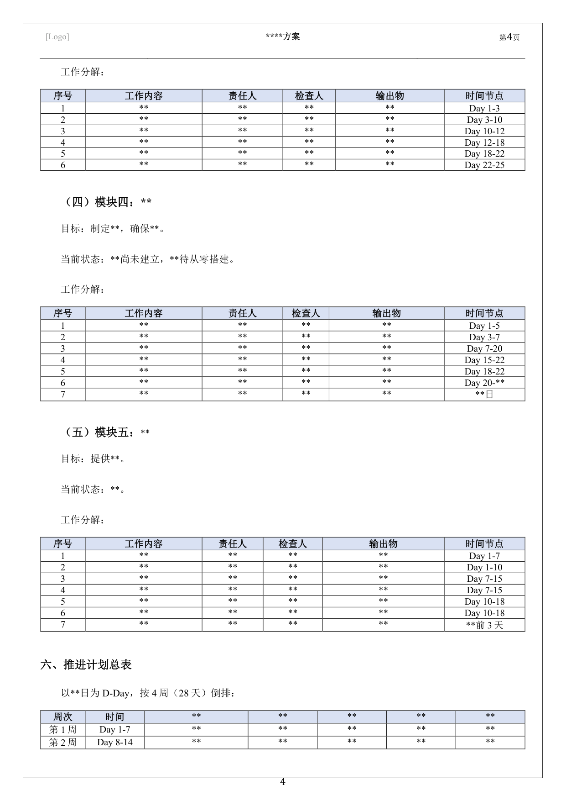
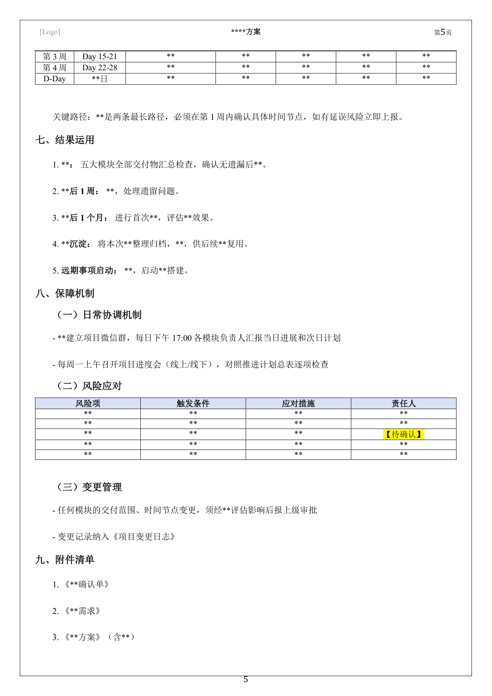
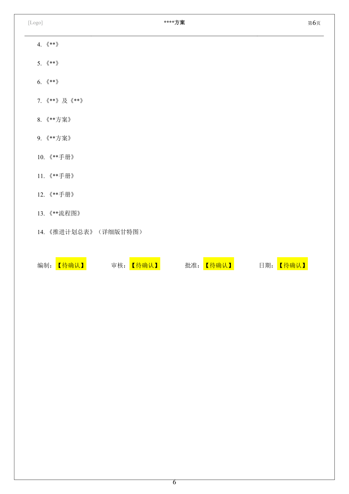

# proposal-writer — 企业实施方案生成器

> Claude Code Skill：通过深度对话采集需求，自动匹配领域方法论，生成高质量的企业项目实施方案。

## 这是什么？

`proposal-writer` 是一个 [Claude Code] 的 Skill，专门用于生成企业级项目实施方案。

它是一个**完整的方案生成系统**——从需求采集、领域知识获取、逻辑框架匹配，到文风控制和 Docx 输出，全流程覆盖。

## 核心能力

- **智能需求采集**：8 阶段提问框架，每轮最多 4 个问题，附带选项降低回答门槛，实时显示信息完整度
- **9 种问题类型自动识别**：诊断-改善、评估-决策、行为塑造、能力建设、体系构建、应急响应、探索创新、整合对齐、维持运营
- **方法论自动匹配**：根据问题类型匹配 PDCA、差距分析、系统设计等方法论内核，支持组合编排
- **专业文风控制**：基于多篇样本交叉分析提炼的文风档案，确保输出风格统一、专业克制
- **领域知识获取**：自动搜索目标领域的成熟方法论、行业标准和最佳实践
- **Docx 导出**：一键生成带封面、审批页、页眉页脚的规范 Word 文档
- **自演化机制**：遇到新问题类型时自动扩展方法论框架

## 适用场景

- 企业管理方案（制度建设、流程优化、组织变革……）
- 项目实施计划（系统上线、产线改造、新业务启动……）
- 专项治理方案（安全整改、质量提升、降本增效……）
- 应急预案与响应方案
- 任何需要"背景 → 目标 → 方案 → 计划 → 保障"完整逻辑链的商务文书

## 快速开始

### 1. 安装

将本仓库克隆到 Claude Code 的 skills 目录：

```bash
# 进入你的项目根目录（或全局配置目录）
cd your-project

# 克隆到 .claude/skills/ 下
git clone https://github.com/popconr/proposal-writer.git .claude/skills/proposal-writer
```

或手动复制文件到 `.claude/skills/proposal-writer/` 目录下。

### 2. 使用

在 Claude Code 中直接触发：

```
/proposal-writer
```

或用自然语言描述你的需求，例如：

```
帮我写一个管理优化实施方案
```

```
我需要一个销售增量方案
```

### 3. 工作流程

```
你简述需求
    ↓
Phase 1：深度需求采集（8 阶段多轮对话）
    ↓
Phase 2：领域识别 + 知识获取
    ↓
Phase 3：方案生成（逻辑框架 + 文风控制）
    ↓
Phase 4：输出 Markdown → 迭代修改 → 导出 Docx
```

你可以在任何阶段说"先生成看看"，AI 会基于已有信息生成方案，不足部分标注 `【待确认】`。

## 方案输出结构

生成的方案遵循严格的逻辑链条：

| 环节 | 回答的问题 |
|------|-----------|
| 背景/现状 | 现状是什么？问题在哪？ |
| 目的 | 要解决什么？达到什么状态？ |
| 原则 | 解决过程中遵循什么准则？ |
| 治理结构 | 谁负责、谁执行、谁监督？ |
| 实施设计 | 用什么方法、分几步解决？ |
| 推进计划 | 什么时间出什么结果？ |
| 结果运用 | 完成后成果如何运用？ |
| 保障机制 | 执行中出问题怎么处理？ |

每个行动项都包含完整责任链：**责任人 → 检查人 → 输出物 → 时间节点**。

## Docx 导出

方案完成后可一键导出为规范的 Word 文档：

- A4 纸张，规范页边距
- 封面页：公司形象图占位 + 方案标题 + 审批信息
- 结构化页眉：Logo | 标题 | 编号 + 页码
- 层级编号：一、→（一）→ 1、→ ①
- 表格：表头加粗 + 浅蓝底色
- `【待确认】` 内容自动黄色高亮，方便定位

**依赖**：需要安装 `python-docx`

```bash
pip install python-docx
```

## 文件结构

```
proposal-writer/
├── SKILL.md                              # Skill 主文件（工作流程 + 行为规则）
├── README.md                             # 本文件
├── references/
│   ├── proposal-logic-framework.md       # 逻辑框架（9 种问题类型 + 方法论）
│   └── writing-style-profile.md          # 文风档案（句式、用词、风格规范）
└── templates/
    └── generate-docx.py                  # Markdown → Docx 转换脚本
```

## 设计理念

### 逻辑框架

从多篇企业实施方案中提炼的底层思维逻辑，不绑定任何行业。核心认知：

- **问题解决逻辑**：诊断 → 设计 → 执行 → 验证 → 固化
- **责任链条**：谁做 → 谁查 → 交什么 → 何时交
- **闭环要求**：每个产出必须指向后续行动

### 文风档案

基于多篇代表性样本交叉分析提炼，核心风格：

> 体系化思维驱动的实操型方案文风——用严密的层级结构把复杂问题拆解为可执行的模块，语言克制精准，重逻辑完整性和可操作性，轻修辞和情感渲染。

### 自演化

当遇到现有 9 种类型无法覆盖的新问题模式时，skill 会：
1. 回到第一性原理设计方案
2. 搜索该领域的成熟方法论
3. 征得用户同意后，将新类型补充到逻辑框架中

框架是活的文档，随着使用不断丰富。

## 方案示例

以下是使用本 Skill 生成的方案预览（点击可查看大图）：








## 许可证

GPLv3.0

## 感谢
https://linux.do/
